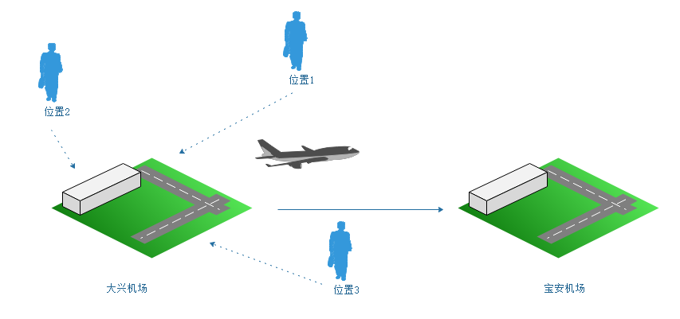
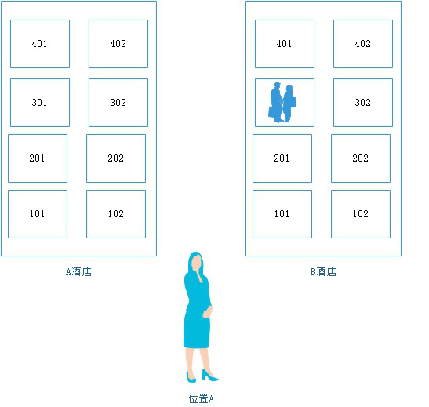
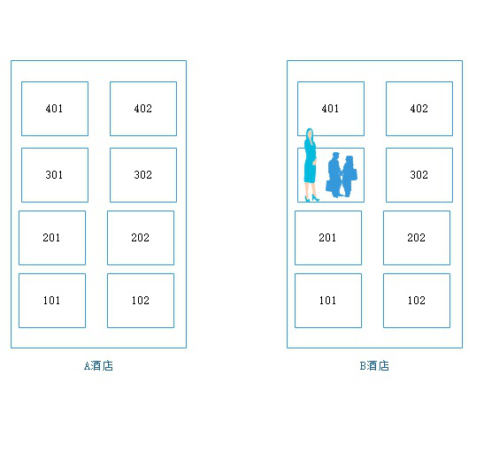
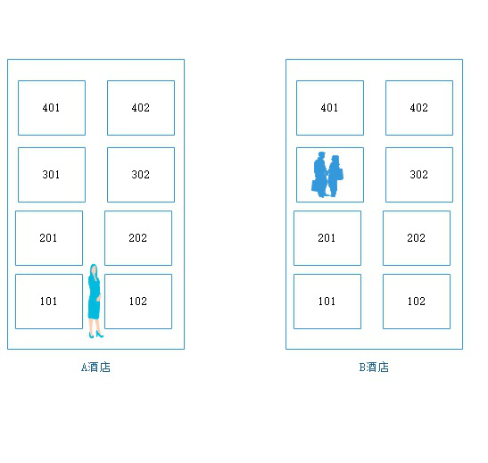
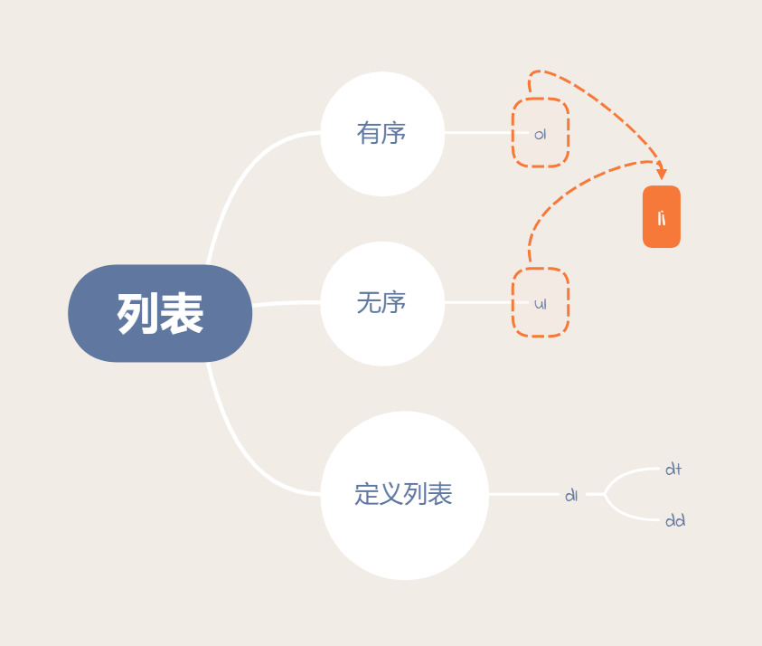
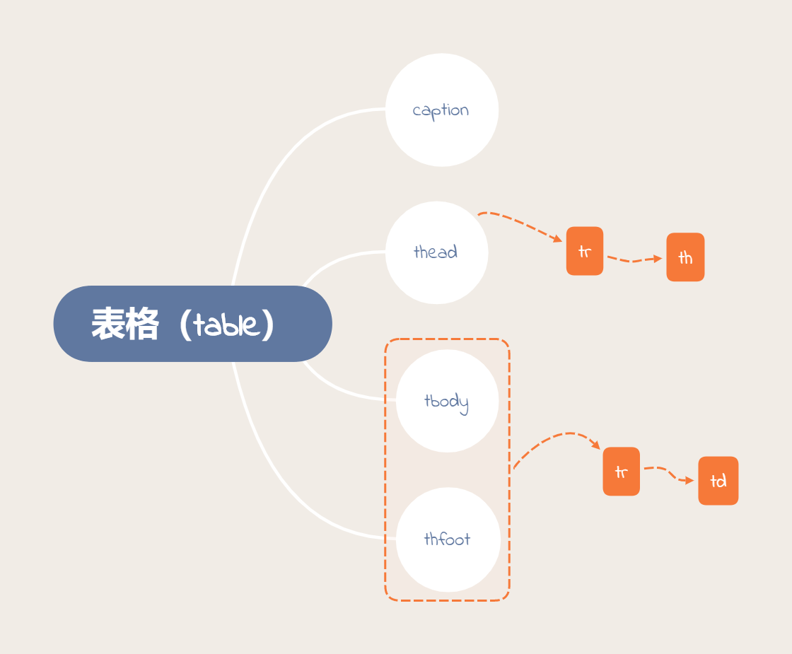
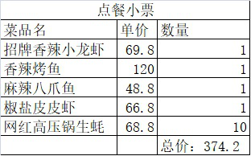

# 02

#### 语义化标签(**)

语义化：有含义。

* `<b>&<strong>`，加粗文本。
* `<i>&<em>`，斜体文本。
* `<u>&<ins>`，文本下划线。
* `<s>&<del>`，删除文本。

__注意：__

1. 一共四组标签，第一种只具有现实效果，第二种不但具备现实效果更强调语义。
2. 语义标签是给搜索引擎看的，搜索引擎只认识`HTML`、`CSS`、`JavaScritp`中的HTML。

#### 绝对路径和相对路径()

路径：当前的文件（html文件）与其他的文件的位置关系。

* 绝对路径：从头开始计算文件出现的路径。

  比如：`http://localhost:52330/4.html`、`https://lgzhyan.gitee.io/`或`C:\xampp\htdocs`

  不管怎么样都是从头开始计算，完整的路径。

  不管我在哪里都需要从大兴机场起飞飞往宝安机场。从__大兴机场开始__


												

* 相对路径：相对于编码文件的位置来计算路径。
  * 相对路径的三种情况：
    * 下级：




​		从位置A->B酒店->301（`yanhaijing`）

​           ` ./B酒店/301/闫海静`

* 同级




​	301(`yanhaijing`)

​	`./yanhaijing`或`yanhaijing`

* 上级：




​		A酒店-》街道-》B酒店-》301（yanhaijing）

​		`../B酒店/301/闫海静`


* 表示方法：

  * 相对路径中`.`代表当前目录。
  * 相对路径中`..`代表当前目录的上级目录。

  `C:\xampp\htdocs\0223\02到C:\xampp\htdocs\0223\01\01.md`->`../01/01.md`

  `2021-02-26_091607.png`->`./2021-02-26_091607.png`或`2021-02-26_091607.png`

  `C:\xampp\htdocs\0223\02`到`C:\xampp\htdocs\yanhaijingzhenyingjun.txt`->`../../yanhaijingzhenyingjun.txt`

#### a链接(****)

链接：在web项目中网页是项目连接的。可以点击跳转到其他内页面的东西我们叫链接。

`<a>`标签：链接到指定的文档。

* `href`属性：要跳转的页面地址，值可以是绝对路径也可以是相对路径。

  __注意：__

  1. 目录大小写问题：如果要写路径，服务器端口如果是在window下那么不区分大小写，如果是在Linux中是严格区分大小写。（你的目录是大写你就大写，你的目录是小写你就小写。）`../Path/1.txt`
  2. `href属性`的值不要写本地的绝对路径。本地的绝对路径走的是File协议，file协议是本地协议不经过网络。
  3. 如果值为网站的绝对路径时要加上`http://`或`https://`（也就是说要加上协议），否则它查找的是本HTML文件的某个文件夹下的内容。
  4. 链接可以链接到HTML文件上也可以链接到其他的地方（比如：图片）。

* `target`属性：点击链接之后在哪里打开。

  * `_blank`，在新窗口打开。
  * `_self`，在本窗口打开（默认。）。
  * `自定义名字`。

锚点：URL片段标识符，请求指定资源的子资源，点击指定链接的时候跳转到指定的位置。

1. 分块

   ```html
   <a name="标记名">
   要进行分块的内容
   </a>
   ```

2. 标记分块

   `<a href="#标记名">标记链接</a>`

__注意：__

1. 第二步标记链接的时候，需要加上`#`号。
2. 第二步标记链接的时候需要和分块所起的名字一样。
3. 有时候我们写页面的时候有可能不知道具体要链接到哪里去，那么这个时候我们可以直接使用一个`#`号来表示这是一个空链接。`<a href="#">空链接</a>`

#### img标签(****)

``图像标签

* src属性：必须的指的是引入的哪个图片。
* alt属性：图像不能正确显示的时候告诉浏览网页的人和搜索引擎这张图的内容是什么。
* width属性：设置图像的宽度。
* height属性：设置图像的高度。

__注意：__

* px是像素：`pixel`，它不是自然界中的长度单位。它是图片中的最小的点。
* 如果同时设定了宽度和高度，图像有可能会失真。
* 如果只是单独的设定了宽度或高度，将会进行等比例缩放。

#### 块级元素及行内元素(**)

* 行内元素与块级元素最直观的区别在于：行内元素会在一行上面排列。块级元素各占一行，垂直方向排列。
* 块状元素中通常会放块状元素和行内元素，行内元素中通常会放一些真正的内容它是不能包含块级元素的。

#### 列表(****)



* 无序列表（序：顺序）

  * 无序列表用`ul标签` 表示，其中包含列表中的具体项。
  * 每一项使用`<li>`来表示。
  * 每一项`<li>`中可以包含其他的标签。

* 有序列表

  * ol表示有序列表。
  * 每个ol中使用li表示每一项。

* 定义列表：由项目描述和项目解释组成。

  * `<dl>`定义一个定义列表
  * `<dt>`，定义列表中的项目（主题）
  * `<dd>`，描述列表中的项目。

  dl只能包含dt和dd，dt和dd中可以包含其他标签。


#### 表格(***)



表格和excel一样，都是用来展示数据的。




案例：课程表。


作业：


#### 内框架(***)
