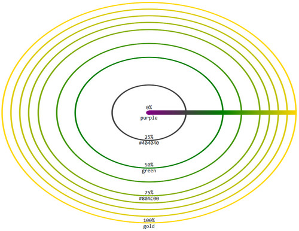

#### 径向渐变

径向渐变是沿着一个中心点像四周扩展颜色进行平滑的过度。

格式：`radial-gradient:[大小][at point] color1 color2.....`

1. 简单的颜色值。

   可以使用CSS中的任何类型的颜色值，包括rgba和transparent，颜色可以有两个或多个。如果有多个默认平均分配在梯度线上。

   默认时，径向渐变在中间显示，在正方形元素中径向渐变为圆形，在长方形元素中径向渐变为椭圆形。

2. 梯度线，梯度线从渐变的中心向右延伸，渐变的其他的部分根据这根线来构建。

3. 默认的时候，如果有多个颜色则平均分配在梯度线上。

   可以给颜色指定一个位置，让他不平均分配，设定的这个就是梯度线上的位置。

   `background-image: radial-gradient(yellow,red 20px ,green);`

4. 大小，在径向渐变中，径向尺寸可以设置渐变图像的大小。

   大小：一个值或两个值。

   如果是一个值，得到的是圆形渐变，值为半径。

   ```html
   <!DOCTYPE html>
   <html>

   <head>
       <style>
           div {
               width: 500px;
               height: 100px;
               border: 1px solid green;

               /* background-image: radial-gradient(yellow,red 20px ,green); */
               background-image:radial-gradient(20px,yellow,green)
           }
       </style>
   </head>

   <body>
       <div>

       </div>
   </body>

   </html>
   ```

   由上面的例子可以看出，最后一个颜色将从梯度线的终点一直向外延伸。

   如果是两个值，得到的是椭圆形渐变，第一个值为椭圆的宽度的一半，第二个值为椭圆的高度的一半。

   ```html
   <!DOCTYPE html>
   <html>

   <head>
       <style>
           div {
               width: 500px;
               height: 500px;
               border: 1px solid green;

               /* background-image: radial-gradient(yellow,red 20px ,green); */
               /* background-image:radial-gradient(20px,yellow,green); */
               background-image: radial-gradient(150px 100px, yellow, green);
           }
       </style>
   </head>

   <body>
       <div>

       </div>
   </body>

   </html>
   ```

5. `at point`默认时径向渐变的中心在元素的中心点，可以使用`at point`来进行更改。point的值就是`background-position`的值。

